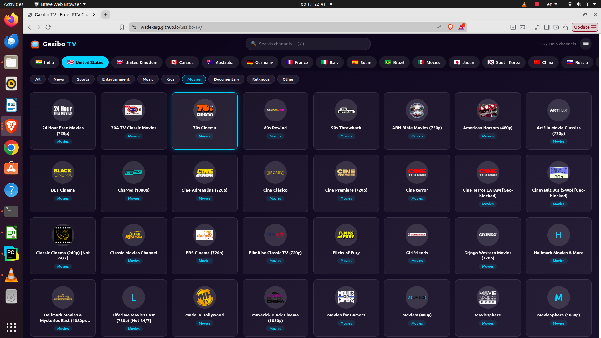
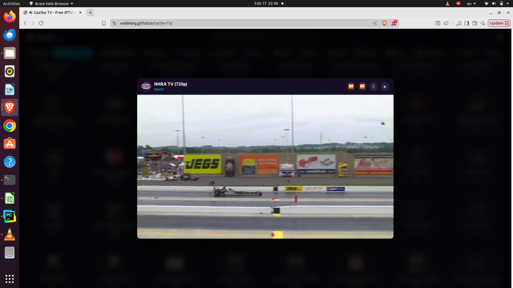

<div align="center">

# Gazibo TV

### Free IPTV from around the world. No sign-ups, no downloads — just open and watch.

[](https://wadekarg.github.io/Gazibo-TV)
[](LICENSE)
[](https://github.com/iptv-org/iptv)
[](https://github.com/iptv-org/iptv)

<br>





</div>

---

## Features

| | Feature |
|---|---------|
| **Channels** | 8,000+ free channels from 40+ countries |
| **Design** | Dark theme with glass-morphism UI |
| **Smart Filtering** | NSFW and DMCA-blocked channels automatically filtered out |
| **Reliability** | Pre-tested blocklist removes broken streams (auto-updated weekly) |
| **Auto-Skip** | Broken channels skipped automatically with 5-second countdown |
| **Categories** | News, Sports, Entertainment, Music, Kids, Movies, Documentary, Religious |
| **Search** | Search across channel names and groups |
| **Player** | HLS.js video player with Safari native fallback |
| **Keyboard** | Full keyboard navigation for a true TV experience |
| **Fresh Data** | Auto-refresh every hour to pick up newly added channels |
| **Responsive** | Works on desktop, tablet, and mobile |
| **Lightweight** | No frameworks, no build tools — pure HTML + CSS + JavaScript |

## Keyboard Shortcuts

| Key | Action |
|:---:|--------|
| `Up` / `Down` | Previous / Next channel (in player) |
| `Left` / `Right` | Navigate channel grid |
| `Enter` | Play focused channel |
| `Escape` | Close player / Clear search |
| `/` | Focus search box |
| `f` | Toggle fullscreen |

## Quick Start

### Option 1: GitHub Pages (Recommended)

Visit the live demo — nothing to install:

> **https://wadekarg.github.io/Gazibo-TV**

### Option 2: Run Locally

```bash
git clone https://github.com/wadekarg/Gazibo-TV.git
cd Gazibo-TV
python3 -m http.server 8080
```

Then open [http://localhost:8080](http://localhost:8080) in your browser.

> **Note:** Opening `index.html` directly won't work due to CORS restrictions on API fetches. You need a local server.

## How It Works

```
Startup
  |
  +--> Load iptv-org API (channels.json, logos.json, blocklist.json)
  +--> Load local blocklist.json (pre-tested broken streams)
  |
  +--> Fetch M3U playlist from iptv-org.github.io/iptv/countries/{code}.m3u
  |
  +--> Parse M3U --> Extract tvg-id, name, logo, group, URL
  |
  +--> Enrich with API data (better logos, accurate categories)
  |
  +--> Filter out: NSFW + DMCA blocked + broken streams
  |
  +--> Render channel grid
  |
  +--> Every 1 hour: silently re-fetch and update grid
```

## Project Structure

```
Gazibo-TV/
  index.html              -- Single-page app
  css/styles.css          -- Dark theme, glass-morphism, responsive grid
  js/
    countries.js          -- Country code/name map, flag emoji helper
    m3u-parser.js         -- M3U text to channel object parser
    api-data.js           -- iptv-org API loader (channels, logos, DMCA blocklist)
    channel-store.js      -- Fetch, cache, filter, broken tracking
    player.js             -- HLS.js wrapper with auto-skip
    ui.js                 -- DOM rendering, tabs, grid, filters, search
    keyboard.js           -- Keyboard navigation
    app.js                -- Init and bootstrap
  blocklist.json          -- Pre-tested broken stream URLs (auto-updated weekly)
  test_streams.py         -- Stream health checker script
  .github/workflows/
    deploy.yml            -- GitHub Pages deployment
    update-blocklist.yml  -- Weekly blocklist refresh
```

## Tech Stack

| Layer | Technology |
|-------|-----------|
| **Frontend** | Pure HTML5 + CSS3 + JavaScript (ES6+) |
| **Video** | [HLS.js](https://github.com/video-dev/hls.js/) via CDN |
| **Data** | [iptv-org/iptv](https://github.com/iptv-org/iptv) + [iptv-org/api](https://github.com/iptv-org/api) |
| **Hosting** | GitHub Pages (free) |
| **CI/CD** | GitHub Actions |

## Updating the Blocklist

The blocklist is automatically updated every Sunday via GitHub Actions. To update manually:

```bash
python3 test_streams.py us in uk ca au de fr br mx jp kr es it pk bd ru tr ae sa eg za ph id th vn pl nl pt ar co
```

This tests every stream URL across 30 countries and saves broken ones to `blocklist.json`.

## Contributing

Contributions are welcome! Here's how:

1. Fork the repo
2. Create a feature branch (`git checkout -b feature/my-feature`)
3. Make your changes
4. Test locally with `python3 -m http.server 8080`
5. Commit (`git commit -m 'Add my feature'`)
6. Push (`git push origin feature/my-feature`)
7. Open a Pull Request

### Ideas for contributions
- Add EPG (Electronic Program Guide) support
- Add channel favorites / bookmarks
- Add picture-in-picture mode
- Add Chromecast support
- Improve category detection
- Add more countries to the blocklist test

## License

MIT License - see [LICENSE](LICENSE) for details.

## Acknowledgements

This project is made possible by the amazing [iptv-org](https://github.com/iptv-org) community. A huge thank you to:

- **[iptv-org/iptv](https://github.com/iptv-org/iptv)** — The largest open-source collection of publicly available IPTV channels from all over the world. This project provides all the channel streams that Gazibo TV plays. With 80k+ stars and thousands of contributors, it's a truly incredible community effort.
- **[iptv-org/api](https://github.com/iptv-org/api)** — Provides the structured API data (channel metadata, logos, categories, blocklists) that makes Gazibo TV's interface rich and accurate.
- **[iptv-org/database](https://github.com/iptv-org/database)** — The community-maintained database behind the API.
- **[HLS.js](https://github.com/video-dev/hls.js/)** — The JavaScript HLS client that powers video playback across all browsers.

Without these open-source projects, Gazibo TV would not exist.

## Legal Notice & Disclaimer

**Gazibo TV does not host, store, transcode, or control any video content.** This project is a client-side web application (a video player interface) that links to publicly available IPTV streams aggregated by the [iptv-org](https://github.com/iptv-org) community. All streams are provided by third-party servers that are not operated by, affiliated with, or controlled by this project or its contributors.

This software is provided "as is" for educational and personal use. The developers make no representations about the legality of any streams accessible through this interface. **Users are solely responsible for ensuring their use of this software complies with all applicable laws in their jurisdiction.**

### Content Filtering

Gazibo TV proactively filters content to promote responsible use:
- **DMCA-blocked channels** are automatically removed using [iptv-org's blocklist](https://github.com/iptv-org/database/blob/master/data/blocklist.csv)
- **NSFW content** is automatically filtered out
- **Broken/dead streams** are detected and deprioritized

### DMCA Policy

We respect the intellectual property rights of others. If you believe that any content accessible through Gazibo TV infringes your copyright, you can take the following actions:

1. **Report to the source:** Since all channel data originates from [iptv-org](https://github.com/iptv-org), the most effective action is to file a report at [iptv-org/database issues](https://github.com/iptv-org/database/issues). Once they remove a channel, it will automatically be removed from Gazibo TV.

2. **Report directly to us:** Open an issue on this repository with:
   - The copyrighted work you believe is being infringed
   - The specific stream URL(s) you want removed
   - Your contact information
   - A statement that you are the copyright owner or authorized to act on their behalf

   We will remove the reported content within **24 hours** of receiving a valid notice.

### What This Project Is NOT

- This is **not** a streaming service — we do not operate any servers that deliver video
- This is **not** a commercial product — there are no ads, subscriptions, or payments
- This is **not** a content aggregator — we do not collect, curate, or upload any streams ourselves
- This is a **software tool** (like VLC or any web browser) that can play publicly available media URLs

## License

MIT License - see [LICENSE](LICENSE) for details.

The MIT license covers the **software code only**. It does not grant any rights to the content (video streams, channel logos, metadata) accessible through this software, which is owned by their respective rights holders.

---

<div align="center">

Made with love by [wadekarg](https://github.com/wadekarg)

</div>
